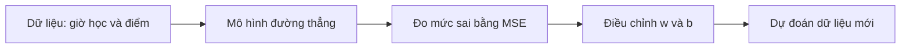
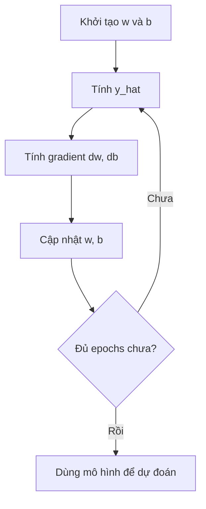

# Linear Regression: Dạy máy vẽ một đường thẳng

> Một bài hướng dẫn trực quan, dễ hiểu và có mã Python thuần dành cho người mới học Machine Learning.

## Linear Regression giải quyết chuyện gì?

Giả sử ta có kết quả của 5 học sinh:

| Số giờ học (`x`) | Điểm thi (`y`) |
|---:|---:|
| 1 | 2 |
| 2 | 4 |
| 3 | 5 |
| 4 | 4 |
| 5 | 5 |

Nhìn vào bảng, ta đoán rằng học nhiều giờ thường sẽ đạt điểm cao hơn. Nhưng máy tính không thể chỉ “nhìn và cảm nhận”. Ta cần giúp máy tìm ra một quy tắc toán học để khi nhận số giờ học mới, nó có thể dự đoán điểm thi.

Linear Regression (hồi quy tuyến tính) làm việc đó bằng cách tìm một đường thẳng đi gần các điểm dữ liệu nhất.



Toàn bộ quá trình có thể gói gọn trong ba câu hỏi:

1. Máy dự đoán bằng công thức nào?
2. Làm sao máy biết mình đang dự đoán sai?
3. Máy sửa công thức như thế nào để sai ít hơn?

---

## 1. Mô hình: chiếc máy dự đoán đơn giản nhất

Công thức của một đường thẳng là:

$$
\hat{y} = wx + b
$$

Trong đó:

| Ký hiệu | Ý nghĩa | Cách hình dung |
|---|---|---|
| $x$ | Dữ liệu đầu vào | Số giờ học |
| $\hat{y}$ | Giá trị mô hình dự đoán | Điểm thi được dự đoán |
| $w$ | Trọng số hay độ dốc | Học thêm 1 giờ thì điểm dự đoán thay đổi bao nhiêu |
| $b$ | Độ lệch hay điểm cắt trục tung | Mức dự đoán ban đầu khi $x=0$ |

Dấu “mũ” trong $\hat{y}$ dùng để phân biệt **giá trị dự đoán** với $y$ là **giá trị thật**.

Ví dụ, nếu mô hình tìm được:

$$
\hat{y} = 0.6x + 2.2
$$

thì với một học sinh học 6 giờ:

$$
\hat{y} = 0.6 \times 6 + 2.2 = 5.8
$$

Mô hình dự đoán điểm của học sinh đó là `5.8`.

### `w` và `b` làm đường thẳng thay đổi ra sao?

- Tăng `w`: đường thẳng dốc lên nhanh hơn.
- Giảm `w`: đường thẳng phẳng hơn; nếu `w` âm, đường sẽ dốc xuống.
- Thay đổi `b`: cả đường thẳng được nâng lên hoặc hạ xuống.

Vì vậy, “huấn luyện mô hình” thực chất là quá trình tìm hai con số `w` và `b` phù hợp nhất.

### Nếu có nhiều đặc trưng thì sao?

Để dự đoán giá nhà từ diện tích và số phòng ngủ, ta có:

$$
\hat{y} = w_1x_1 + w_2x_2 + b
$$

Mỗi đầu vào có một trọng số riêng. Ý tưởng không đổi, chỉ có số lượng tham số tăng lên.

---

## 2. Loss function: chiếc thước đo độ sai

Ta có thể nhìn bằng mắt để chọn một đường khá đẹp, nhưng máy tính cần một con số cụ thể. Con số này được gọi là **loss** hoặc **cost**.

Với hồi quy tuyến tính, thước đo phổ biến là Mean Squared Error — sai số bình phương trung bình:

$$
J(w,b) = \frac{1}{n}\sum_{i=1}^{n}(\hat{y}_i-y_i)^2
$$

Đừng để công thức làm bạn sợ. Nó chỉ thực hiện ba việc:

1. Lấy điểm dự đoán trừ điểm thật.
2. Bình phương kết quả để số âm và số dương không triệt tiêu nhau.
3. Lấy trung bình sai số của tất cả học sinh.

### So sánh hai đường thẳng

Với mô hình thứ nhất $\hat{y}=x+1$:

| `x` | Điểm thật | Điểm dự đoán | Sai số | Sai số² |
|---:|---:|---:|---:|---:|
| 1 | 2 | 2 | 0 | 0 |
| 2 | 4 | 3 | -1 | 1 |
| 3 | 5 | 4 | -1 | 1 |
| 4 | 4 | 5 | 1 | 1 |
| 5 | 5 | 6 | 1 | 1 |

$$
MSE = \frac{0+1+1+1+1}{5}=0.8
$$

Với mô hình tối ưu $\hat{y}=0.6x+2.2$, MSE chỉ còn `0.48`.

MSE càng nhỏ thì đường thẳng càng gần dữ liệu. MSE bằng `0` nghĩa là mọi dự đoán đều trùng khớp hoàn toàn với giá trị thật — điều hiếm xảy ra với dữ liệu thực tế.

> Bình phương khiến lỗi lớn bị phạt rất nặng. Sai `2` tạo ra giá trị `4`, nhưng sai `10` tạo ra `100`. Vì vậy MSE khá nhạy với dữ liệu bất thường (outlier).

---

## 3. Gradient Descent: học bằng cách sửa sai từng bước

Ta đã có:

- một công thức dự đoán: $\hat{y}=wx+b$;
- một chiếc thước đo sai: MSE.

Bây giờ cần tìm `w` và `b` làm MSE nhỏ nhất. Gradient Descent giải quyết việc này giống như một người xuống núi trong sương mù:

1. Kiểm tra mặt đất đang dốc theo hướng nào.
2. Bước một bước nhỏ theo hướng đi xuống.
3. Đo lại độ dốc rồi tiếp tục.

“Độ dốc” trong toán học được gọi là **gradient**:

$$
\frac{\partial J}{\partial w}
=\frac{2}{n}\sum_{i=1}^{n}(\hat{y}_i-y_i)x_i
$$

$$
\frac{\partial J}{\partial b}
=\frac{2}{n}\sum_{i=1}^{n}(\hat{y}_i-y_i)
$$

Sau đó cập nhật:

$$
w \leftarrow w-\alpha\frac{\partial J}{\partial w}
$$

$$
b \leftarrow b-\alpha\frac{\partial J}{\partial b}
$$

$\alpha$ là **learning rate** — độ dài của mỗi bước đi.

| Learning rate | Điều có thể xảy ra |
|---|---|
| Quá lớn | Bước vượt qua đáy, loss dao động hoặc tăng |
| Quá nhỏ | Học đúng hướng nhưng rất chậm |
| Phù hợp | Loss giảm ổn định và mô hình hội tụ |

### Một bước học diễn ra như thế nào?

Khởi đầu với `w = 0`, `b = 0`, mọi dự đoán đều bằng `0`, nên MSE là `17.2`.

Tại vị trí này:

$$
\frac{\partial J}{\partial w}=-26.4,\qquad
\frac{\partial J}{\partial b}=-8
$$

Chọn learning rate `0.01`:

$$
w=0-0.01(-26.4)=0.264
$$

$$
b=0-0.01(-8)=0.08
$$

Sau đúng một lần cập nhật, MSE giảm từ `17.2` xuống khoảng `11.45`. Lặp lại đủ nhiều lần, mô hình tiến gần tới `w = 0.6`, `b = 2.2` và MSE `0.48`.

Mỗi vòng lặp qua toàn bộ dữ liệu thường được gọi là một **epoch**.

---

## 4. Tự xây Linear Regression bằng Python

Ví dụ dưới đây chỉ dùng Python thuần để bạn nhìn rõ từng bộ phận của thuật toán:

```python
xs = [1, 2, 3, 4, 5]
ys = [2, 4, 5, 4, 5]

w = 0.0
b = 0.0
learning_rate = 0.01
epochs = 2000
n = len(xs)

for epoch in range(epochs):
    # Bước 1: dự đoán bằng w và b hiện tại
    predictions = [w * x + b for x in xs]

    # Bước 2: tính gradient của w và b
    dw = (2 / n) * sum(
        (prediction - y) * x
        for x, y, prediction in zip(xs, ys, predictions)
    )
    db = (2 / n) * sum(
        prediction - y
        for y, prediction in zip(ys, predictions)
    )

    # Bước 3: đi ngược hướng gradient để giảm loss
    w -= learning_rate * dw
    b -= learning_rate * db

    # Theo dõi quá trình học
    if epoch % 200 == 0:
        mse = sum(
            (prediction - y) ** 2
            for y, prediction in zip(ys, predictions)
        ) / n
        print(f"Epoch {epoch:4d} | w={w:.4f} | b={b:.4f} | MSE={mse:.4f}")

print(f"\nMô hình: y_hat = {w:.4f}x + {b:.4f}")

hours = 6
predicted_score = w * hours + b
print(f"Học {hours} giờ -> điểm dự đoán: {predicted_score:.2f}")
```

Kết quả cuối sẽ xấp xỉ:

```text
Mô hình: y_hat = 0.6000x + 2.2000
Học 6 giờ -> điểm dự đoán: 5.80
```

### Đọc đoạn mã như một pipeline



---

## 5. Normal Equation: tìm đáp án trực tiếp

Gradient Descent dò lời giải qua nhiều bước. Riêng Linear Regression còn có một lối tắt bằng đại số tuyến tính:

$$
\theta=(X^TX)^{-1}X^Ty
$$

Trong đó:

- $X$ là ma trận dữ liệu;
- cột đầu tiên của $X$ toàn số `1` để biểu diễn bias;
- $y$ là vector chứa kết quả thật;
- $\theta=[b,w]^T$ chứa các tham số cần tìm.

Với dữ liệu đang dùng:

$$
X=
\begin{bmatrix}
1&1\\
1&2\\
1&3\\
1&4\\
1&5
\end{bmatrix},qquad
y=
\begin{bmatrix}
2\\4\\5\\4\\5
\end{bmatrix}
$$

Áp dụng công thức sẽ thu được:

$$\theta = \begin{bmatrix} b \\ w \end{bmatrix} = \begin{bmatrix} 2.2 \\ 0.6 \end{bmatrix}$$

Vì vậy đường thẳng tốt nhất là:

$$
\boxed{\hat{y}=0.6x+2.2}
$$

Trong mã thực tế, nên dùng `numpy.linalg.lstsq()` hoặc pseudo-inverse thay vì tự tính nghịch đảo ma trận. Cách đó ổn định hơn khi ma trận không khả nghịch hoặc gần suy biến.

```python
import numpy as np

x = np.array([1, 2, 3, 4, 5], dtype=float)
y = np.array([2, 4, 5, 4, 5], dtype=float)

# Ghép một cột số 1 với cột x: mỗi hàng có dạng [1, x]
X = np.column_stack((np.ones_like(x), x))

theta, *_ = np.linalg.lstsq(X, y, rcond=None)
b, w = theta

print(f"w = {w:.1f}, b = {b:.1f}")
```

---

## 6. Gradient Descent hay lời giải đại số?

| Tiêu chí | Gradient Descent | Lời giải đại số |
|---|---|---|
| Cách hoạt động | Cải thiện dần qua nhiều bước | Tính trực tiếp |
| Learning rate | Cần chọn | Không cần |
| Dữ liệu và số đặc trưng lớn | Phù hợp hơn | Có thể tốn bộ nhớ và phép tính |
| Mục đích học tập | Giúp hiểu cách nhiều mô hình ML được huấn luyện | Giúp hiểu bản chất toán học của Linear Regression |

Với bài toán nhỏ, cả hai đều hữu ích. Với Machine Learning hiện đại, tư duy **dự đoán → đo lỗi → tính gradient → cập nhật tham số** quan trọng hơn, vì nó xuất hiện cả trong mạng nơ-ron và mô hình ngôn ngữ lớn.

---

## 7. Những hiểu lầm người mới thường gặp

### “Đường tốt nhất phải đi qua tất cả điểm dữ liệu”

Không nhất thiết. Nó cần làm **tổng sai số bình phương nhỏ nhất**. Dữ liệu thực thường có nhiễu nên một đường thẳng khó đi qua mọi điểm.

### “Loss nhỏ nghĩa là mô hình chắc chắn tốt”

Loss nhỏ trên dữ liệu huấn luyện mới chỉ là một phần. Ta còn phải kiểm tra trên dữ liệu mô hình chưa từng thấy để biết nó có dự đoán tốt hay chỉ ghi nhớ dữ liệu cũ.

### “Học nhiều giờ chắc chắn làm điểm tăng tuyến tính mãi mãi”

Không. Linear Regression chỉ đang giả định mối quan hệ gần giống đường thẳng trong phạm vi dữ liệu quan sát. Nếu đem mô hình dự đoán quá xa phạm vi đó, kết quả có thể vô lý.

### “Gradient Descent luôn tìm được đáp án tốt”

Với MSE của Linear Regression, bề mặt loss có dạng lồi nên Gradient Descent có thể tiến tới nghiệm tối ưu nếu learning rate phù hợp. Nhưng learning rate quá lớn vẫn có thể khiến quá trình học không hội tụ.

---

## Tổng kết

Linear Regression không chỉ là “vẽ một đường thẳng”. Đây là phiên bản thu nhỏ của cách một mô hình Machine Learning học:

$$
\text{Dữ liệu}
\rightarrow \text{Dự đoán}
\rightarrow \text{Đo sai số}
\rightarrow \text{Điều chỉnh tham số}
\rightarrow \text{Dự đoán tốt hơn}
$$

Ba mảnh ghép quan trọng nhất cần nhớ:

- **Model:** $\hat{y}=wx+b$ tạo ra dự đoán.
- **Loss:** MSE cho biết mô hình sai nhiều hay ít.
- **Optimizer:** Gradient Descent điều chỉnh `w` và `b` để loss giảm dần.

Khi hiểu rõ ba phần này, bạn đã có nền móng để học Logistic Regression, Neural Network, PyTorch và nhiều mô hình phức tạp hơn.
