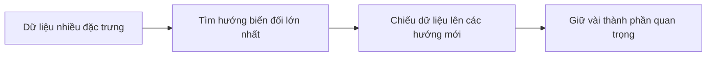

## Principal Component Analysis (PCA) – Thu gọn dữ liệu mà vẫn giữ phần quan trọng
> Tài liệu nhập môn Principal Component Analysis (PCA) dành cho người mới học Machine Learning.
> 
> Mục tiêu: hiểu PCA bằng trực giác trước, sau đó mới nhìn vào công thức và mã Python.

## 1. PCA giải quyết vấn đề gì?

Giả sử mỗi học sinh được mô tả bằng 10 thông tin: số giờ học, điểm Toán, điểm Văn, thời gian ngủ, số buổi nghỉ… Mỗi thông tin là một đặc trưng (feature), nên mỗi học sinh là một điểm trong không gian 10 chiều.

Không gian 10 chiều rất khó quan sát. PCA giúp biến 10 đặc trưng ban đầu thành vài đặc trưng mới nhưng vẫn giữ lại phần lớn sự khác biệt giữa các học sinh.

Ví dụ:

```
10 đặc trưng ban đầu ──PCA──> 2 thành phần chính
        khó nhìn                  dễ vẽ và phân tích
```

PCA thường được dùng để:

- nén dữ liệu và giảm số cột;
- vẽ dữ liệu nhiều chiều trên mặt phẳng;
- giảm nhiễu;
- phát hiện nhóm hoặc điểm bất thường;
- giúp một số mô hình học máy chạy nhanh hơn.

## 2. Trực giác: Tìm góc nhìn tốt nhất

Hãy tưởng tượng các điểm dữ liệu là một đám mây dài và nghiêng. Nếu chiếu chúng xuống một đường thẳng phù hợp, các “bóng” vẫn cách xa nhau và ta còn nhận ra hình dạng chính của đám mây.

- **PC1** là hướng mà các bóng trải rộng nhất. Nó giữ nhiều thông tin nhất.
- **PC2** vuông góc với PC1 và giữ phần biến đổi quan trọng tiếp theo.
- PC3, PC4… cũng được tìm tương tự.



Trong PCA, **thông tin** được đo gần đúng bằng **phương sai**: dữ liệu càng trải rộng trên một hướng thì hướng ấy càng giúp phân biệt các mẫu.

> PCA không chọn vài cột cũ để giữ lại. Nó tạo ra các cột mới bằng cách trộn những cột ban đầu.

## 3. Ba khái niệm cần biết

### Phương sai (variance)

Phương sai cho biết các giá trị phân tán quanh giá trị trung bình nhiều hay ít.

- Phương sai nhỏ: các giá trị nằm gần nhau.
- Phương sai lớn: các giá trị cách xa nhau.

### Hiệp phương sai (covariance)

Hiệp phương sai cho biết hai đặc trưng thường thay đổi cùng nhau ra sao.

- Dương: một đại lượng tăng thì đại lượng kia thường tăng.
- Âm: một đại lượng tăng thì đại lượng kia thường giảm.
- Gần 0: chưa thấy quan hệ tuyến tính rõ ràng.

Ma trận hiệp phương sai của hai đặc trưng có dạng:

$$
\Sigma =
\begin{bmatrix}
\mathrm{Var}(X_1) & \mathrm{Cov}(X_1,X_2) \\\\
\mathrm{Cov}(X_2,X_1) & \mathrm{Var}(X_2)
\end{bmatrix}
$$

Đường chéo chứa phương sai của từng đặc trưng; hai ô còn lại cho biết chúng thay đổi cùng nhau thế nào.

### Vector riêng và trị riêng

Với phương trình

$$
\Sigma v = \lambda v
$$

- $v$ là **vector riêng**: hướng đặc biệt không bị đổi hướng khi qua phép biến đổi $\Sigma$;
- $\lambda$ là **trị riêng**: mức độ dữ liệu trải rộng theo hướng đó.

Trong PCA:

- Vector riêng trở thành hướng của các thành phần chính;
- Trị riêng càng lớn thì thành phần đó càng quan trọng.

## 4. Quy trình PCA qua một ví dụ nhỏ

Ta có 5 mẫu và 2 đặc trưng:

| Mẫu | $X_1$ | $X_2$ |
|---|---:|---:|
| A | 1 | 2 |
| B | 2 | 3 |
| C | 3 | 5 |
| D | 4 | 6 |
| E | 5 | 9 |

Ma trận ban đầu có kích thước:

$$
X_{gốc}: (5,2) = (\text{5 mẫu},\text{2 đặc trưng})
$$

### Bước 1: Đưa tâm dữ liệu về 0

Trung bình của hai cột lần lượt là 3 và 5. Ta lấy từng giá trị trừ trung bình cột tương ứng:

| Mẫu | $X_1-3$ | $X_2-5$ |
|---|---:|---:|
| A | -2 | -3 |
| B | -1 | -2 |
| C | 0 | 0 |
| D | 1 | 1 |
| E | 2 | 4 |

Đây gọi là **center dữ liệu**. Việc này chỉ dời cả đám mây điểm về gốc tọa độ, không làm thay đổi hình dạng của nó.

### Bước 2: Tạo ma trận hiệp phương sai

Với $n=5$ mẫu:

$$\Sigma = \frac{1}{n-1}X^TX = \begin{bmatrix} 2.5 & 4.25 \\\\ 4.25 & 7.5 \end{bmatrix}$$

Kích thước thay đổi như sau:

$$
X^T_{(2,5)}X_{(5,2)}=\Sigma_{(2,2)}
$$

Hai số `4.25` dương và khá lớn cho thấy $X_1$ và $X_2$ thường tăng cùng nhau.

### Bước 3: Tìm các hướng mới

Từ ma trận $\Sigma$, ta thu được gần đúng:

| Thành phần | Trị riêng | Vector riêng |
|---|---:|---|
| PC1 | 9.93 | $[0.51,\ 0.86]$ |
| PC2 | 0.07 | $[-0.86,\ 0.51]$ |

PC1 có thể hiểu là:

$$
PC1 = 0.51X_1 + 0.86X_2
$$

Cả hai đặc trưng đều đóng góp cùng chiều, nhưng $X_2$ có ảnh hưởng mạnh hơn một chút.

### Bước 4: Đổi tọa độ

Ghép các vector riêng thành ma trận chiếu:

$$
W=
\begin{bmatrix}
0.51 & -0.86\\
0.86 & 0.51
\end{bmatrix}
$$

Tọa độ mới, còn gọi là **scores**, được tính bằng:

$$
Z=XW
$$

Nếu chỉ muốn giảm từ 2 chiều xuống 1 chiều, ta chỉ giữ cột PC1 của $W$:

$$
X_{(5,2)}W_{(2,1)}=Z_{(5,1)}
$$

### Bước 5: Kiểm tra lượng thông tin giữ lại

Tỉ lệ phương sai giải thích của thành phần thứ $i$ là:

$$
r_i=\frac{\lambda_i}{\sum_j\lambda_j}
$$

Trong ví dụ này:

- PC1 giữ khoảng $9.93/10=99.3\%$ phương sai;
- PC2 giữ khoảng $0.07/10=0.7\%$ phương sai.

Như vậy, thay hai cột bằng một cột PC1 vẫn giữ được gần như toàn bộ cấu trúc chính của dữ liệu.
